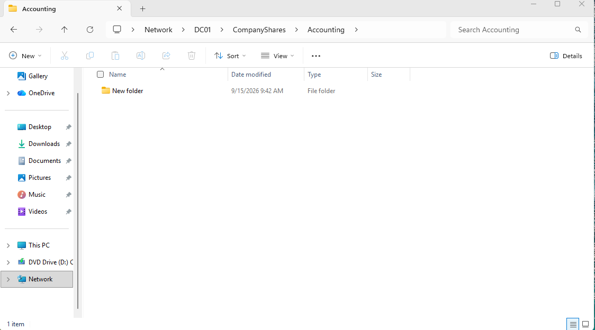
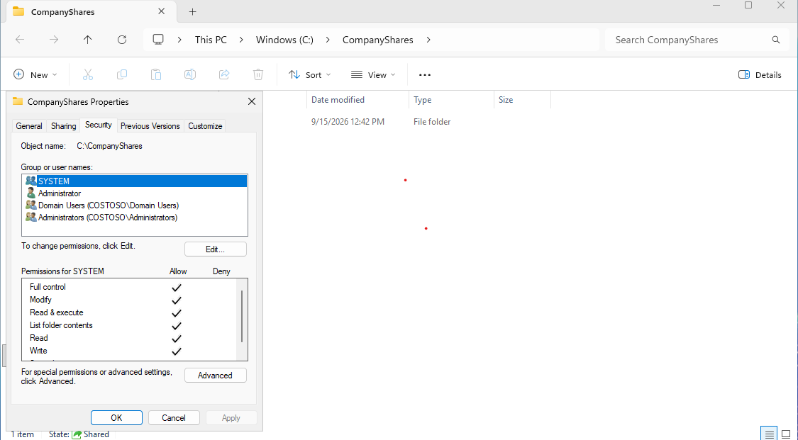
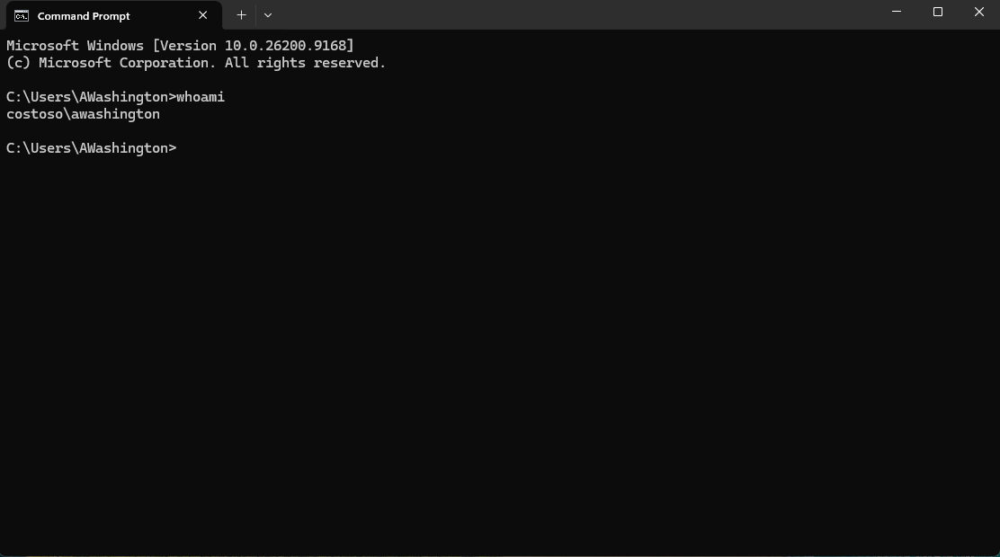

# IAM Access Control Lab

## Overview

For this lab, I wanted to practice how access works in an Active Directory environment.

I already had a Windows Server domain set up with users in different departments. I used two test users:

- **Aisha Washington** - Accounting
- **Avery** - Sales

The goal was simple: Aisha should be able to access the Accounting folder, and Avery should not.

---

## What I Set Up

I created a shared folder on the domain controller:

`\\DC01\CompanyShares\Accounting`

I used an Active Directory security group for the Accounting department and gave that group **Modify** access to the Accounting folder.

Aisha is part of the Accounting group, while Avery is a Sales user and is not part of that group.

---

## Testing Aisha's Access

I signed into CLIENT01 using Aisha's domain account and opened the Accounting share.

Aisha was able to access the folder successfully and create content inside it.



I also checked the permissions on the Accounting folder to verify that the Accounting security group had the correct access.



I used `whoami` to confirm which domain account was logged in.



I also used:

```powershell
whoami /groups
