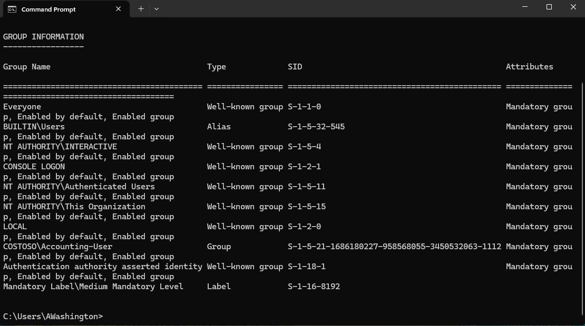
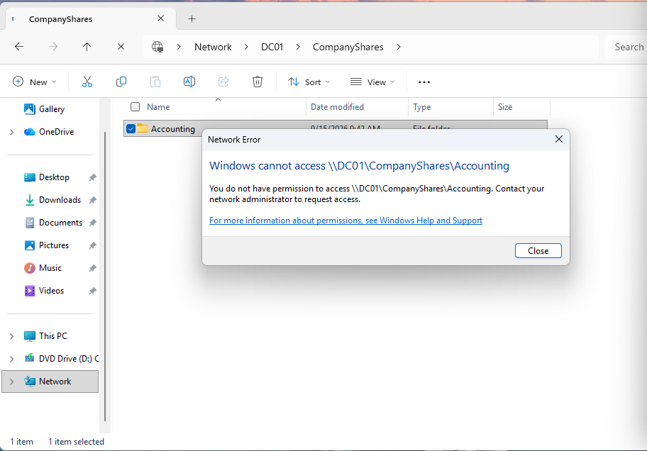
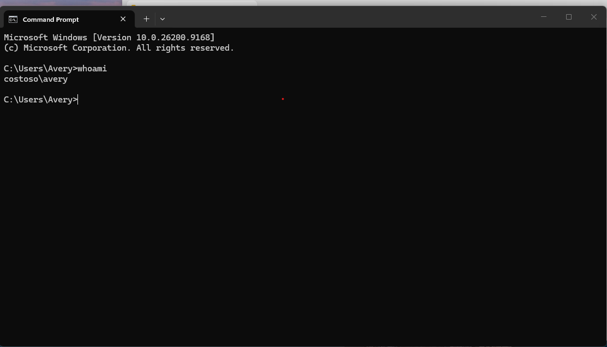
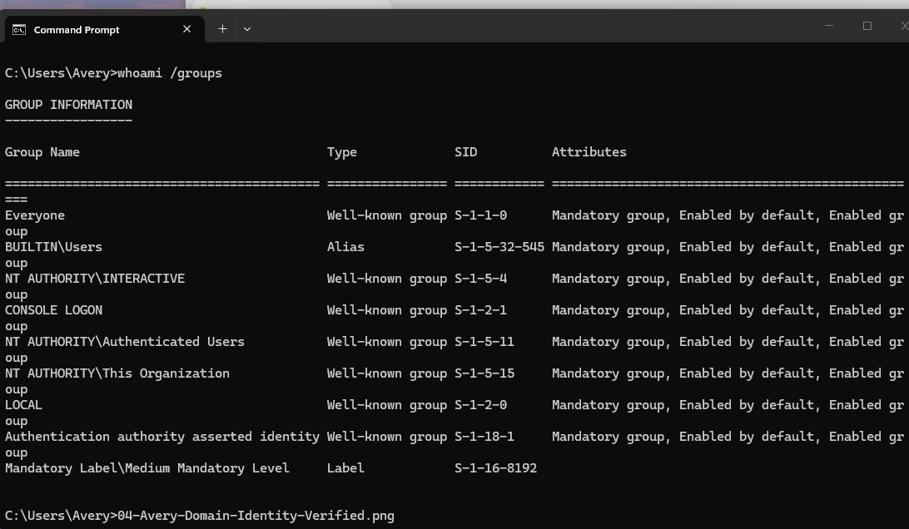

# IAM Access Control Lab

## Overview

For this lab, I wanted to practice how access works in an Active Directory environment.

I already had a Windows Server domain set up with users in different departments. I used two test users:

- **Aisha Washington** - Accounting
- **Avery** - Sales

The goal was simple: Aisha should be able to access the Accounting folder, and Avery should not.

---

## What I Set Up

I created a shared folder on the domain controller:

`\\DC01\CompanyShares\Accounting`

I used an Active Directory security group for the Accounting department and gave that group **Modify** access to the Accounting folder.

Aisha is part of the Accounting group, while Avery is a Sales user and is not part of that group.

---

## Testing Aisha's Access

I signed into CLIENT01 using Aisha's domain account and opened the Accounting share.

Aisha was able to access the folder successfully and create content inside it.


I also checked the permissions on the Accounting folder to verify that the Accounting security group had the correct access.


I used `whoami` to confirm which domain account was logged in.


I also used:

```powershell
whoami /groups
```

to check Aisha's group memberships.



---

## Testing a User Without Access

Next, I signed out of Aisha and logged into CLIENT01 as Avery, who is in the Sales department.

Avery could access the company share, but when I tried opening the Accounting folder, Windows returned an **Access Denied** message.



I confirmed the logged-in account using:

```powershell
whoami
```



I also checked Avery's groups with:

```powershell
whoami /groups
```



---

## What I Learned

This lab helped me understand the difference between **authentication and authorization**.

Both Aisha and Avery are valid users in the Costoso domain, so both of them can log into a domain-joined computer.

That does not mean they should have access to the same resources.

Aisha's group membership gives her access to Accounting resources, while Avery is denied because his role does not require that access.

This helped me practice:

- Active Directory users and groups
- Domain authentication
- Group-based access control
- NTFS permissions
- Least privilege
- Testing allowed vs denied access
- Using `whoami` and `whoami /groups` to verify identity and group membership

---

## Next Steps

Next, I want to build on this by practicing real IAM lifecycle scenarios like:

- onboarding a new employee
- moving a user from one department to another
- removing access when an employee leaves
- troubleshooting incorrect group membership and access issues
