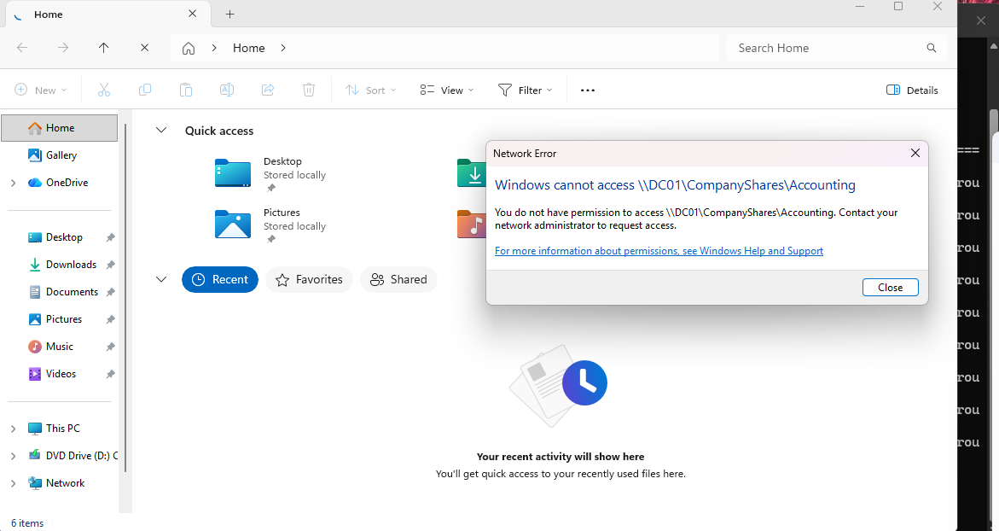
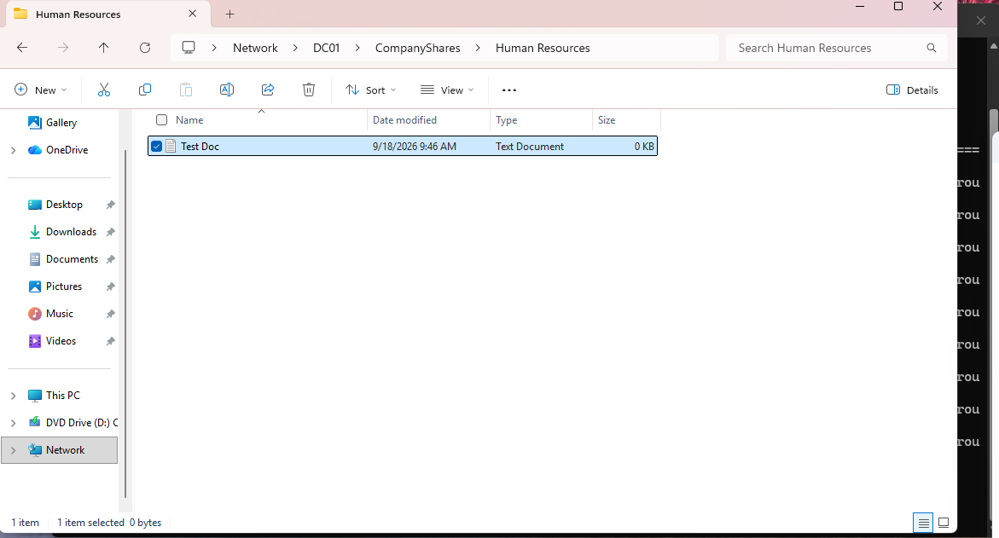
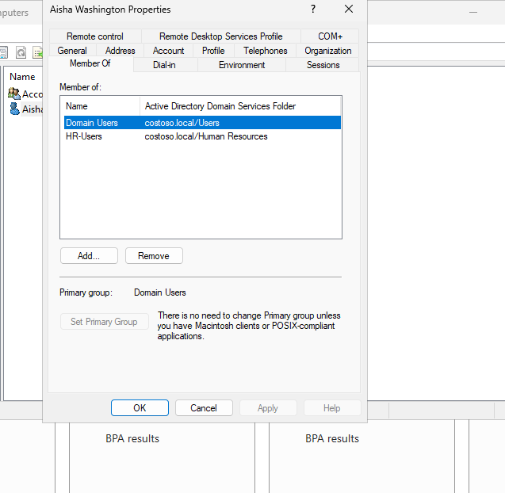

# IAM Mover Access Change Lab

## Overview

For this lab, I practiced a real IAM "mover" scenario.

Aisha Washington was originally in the Accounting department and had access to the Accounting shared folder.

The scenario was that Aisha transferred from Accounting to Human Resources, so her access needed to change with her job role.

The goal was to make sure she:

- lost access to Accounting resources
- gained access to Human Resources resources
- kept her normal domain account

---

## Original Access

Before the change, Aisha was a member of the Accounting security group and could access:

`\\DC01\CompanyShares\Accounting`

Her access was based on group membership instead of assigning permissions directly to her user account.

---

## Updating Aisha's Group Membership

On the domain controller, I updated Aisha's Active Directory group memberships.

I removed her from:

`Accounting-Users`

and added her to:

`HR-Users`

I left her normal `Domain Users` membership in place.

After making the change, I signed Aisha out of CLIENT01 and signed her back in so Windows would create a new security token with the updated group membership.

---

## Verifying Accounting Access Was Removed

After Aisha signed back into CLIENT01, I tried opening:

`\\DC01\CompanyShares\Accounting`

Windows returned an **Access Denied** message.

This confirmed that removing Aisha from the Accounting group also removed her access to Accounting resources.

---

## Giving Aisha HR Access

I created a new Human Resources folder under the company share:

`C:\CompanyShares\Human Resources`

I added the `HR-Users` security group to the folder permissions and gave the group:

- Modify
- Read & execute
- List folder contents
- Read
- Write

I did not give the group Full Control.

---

## Verifying HR Access

Back on CLIENT01, I opened:

`\\DC01\CompanyShares\Human Resources`

Aisha was able to access the folder successfully and create a test document inside it.

This confirmed that her new HR access was working.

---

## Verifying Group Membership

I also checked Aisha's Active Directory account to make sure her group memberships matched her new role.

She was now a member of:

- `Domain Users`
- `HR-Users`

She was no longer a member of `Accounting-Users`.

---

## What I Learned

This lab helped me understand how IAM handles a user changing roles inside a company.

Instead of creating a new account for Aisha, I kept her existing identity and updated the access connected to that identity.

The main idea was:

**Job role changes → group membership changes → resource access changes**

This lab gave me hands-on practice with:

- IAM mover workflows
- Active Directory group membership
- role-based access control
- least privilege
- removing old access after a department change
- granting new access based on job role
- refreshing Windows security tokens after group changes
- testing access after IAM changes

---

## Next Steps

Next, I want to continue practicing IAM lifecycle scenarios such as:

- offboarding an employee
- disabling an account
- removing access during termination
- onboarding a new employee
- troubleshooting incorrect permissions and group memberships
