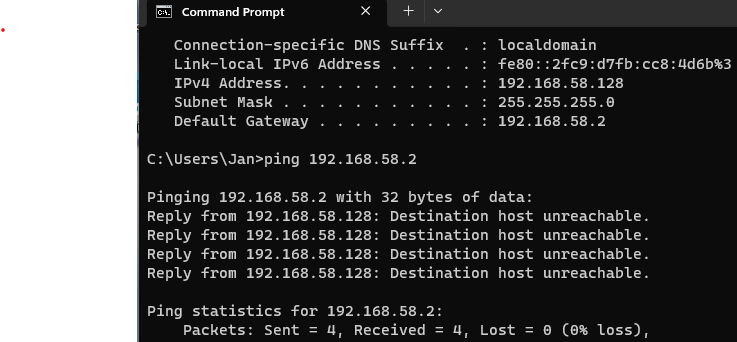
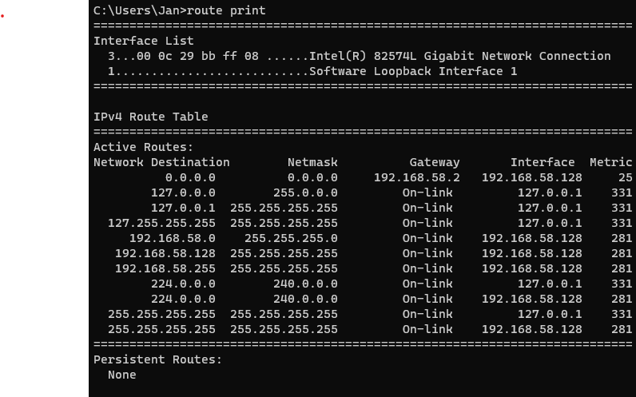
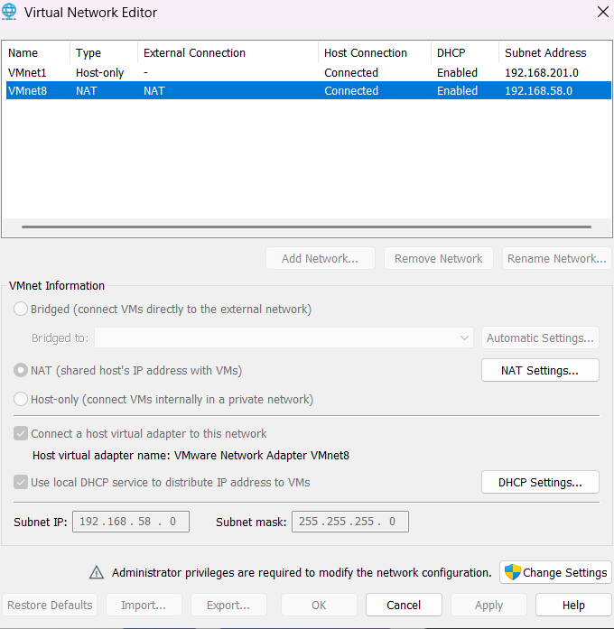
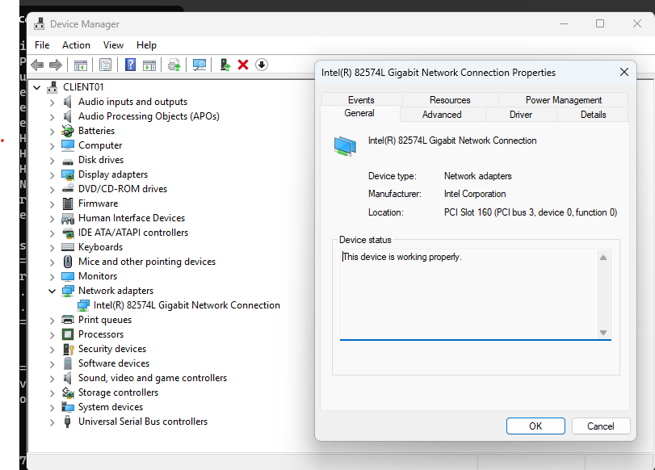
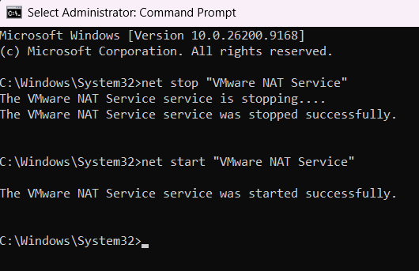
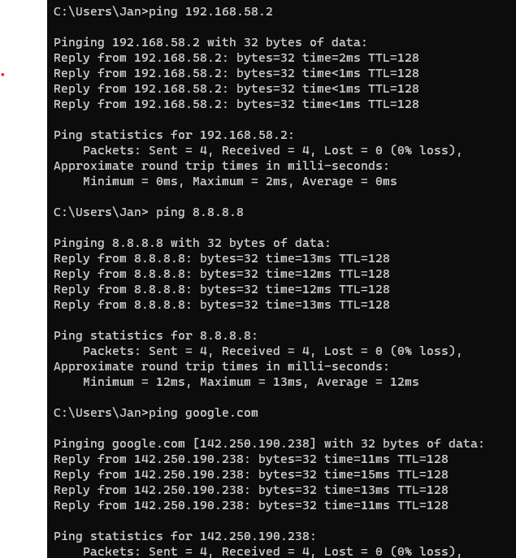
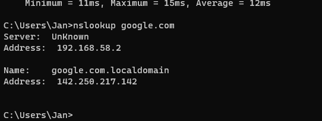

# VMware NAT Troubleshooting Lab

## What I Was Trying to Do

I was setting up a Windows 11 virtual machine in VMware Workstation Pro so I could use it for networking and IT support labs.

The VM was able to start normally and had an IP address, but it could not connect to the Internet.

## Lab Setup

- VMware Workstation Pro
- Windows 11 Pro
- VM name: CLIENT01
- Network type: NAT
- VMnet8 subnet: 192.168.58.0/24
- CLIENT01 IP: 192.168.58.128
- Default gateway: 192.168.58.2
- Subnet mask: 255.255.255.0

## The Problem

At first, CLIENT01 looked like it was configured correctly.

It had:

- an IPv4 address
- a subnet mask
- a default gateway
- DHCP enabled

But when I tried to ping the Internet, it failed.

Command used: `ping 8.8.8.8`

I was getting timeouts and "Destination host unreachable."

## Troubleshooting

### Checked the IP Configuration

I started with:

`ipconfig /all`

This showed that CLIENT01 had a valid IP address and was getting its network settings through DHCP.

### Tested the Default Gateway

Next I tried:

`ping 192.168.58.2`

The ping failed.

Since the default gateway is the first place the VM needs to reach before going out to the Internet, this told me the problem was probably somewhere between the VM and VMware's NAT network.

### Checked the Routing Table

I ran:

`route print`

The default route was there and pointed to:

`192.168.58.2`

The route also showed CLIENT01 using its own interface address:

`192.168.58.128`

So the VM knew where it was supposed to send traffic.

### Checked ARP

I ran:

`arp -a`

ARP helped me see which local IP addresses CLIENT01 was able to match with MAC addresses.

At first, the VMware NAT gateway at `192.168.58.2` did not appear in the ARP table.

I did see other addresses on the VMware network, including `192.168.58.254`.

Later, after testing the host-side VMware adapter, CLIENT01 was able to resolve `192.168.58.1` to a MAC address.

This showed that some local communication on the VMware virtual network was working.

### Checked VMware Network Settings

I opened VMware's Virtual Network Editor and checked VMnet8.

I confirmed that:

- VMnet8 was using NAT
- DHCP was enabled
- the host virtual adapter was connected
- the subnet was 192.168.58.0
- the subnet mask was 255.255.255.0

### Checked the Host-Side VMware Adapter

On my host computer, I ran:

`ipconfig`

The VMware Network Adapter VMnet8 had the IPv4 address:

`192.168.58.1`

I then tried to ping that address from CLIENT01:

`ping 192.168.58.1`

The ping timed out.

I checked the ARP table again and saw that CLIENT01 had still learned the MAC address for 192.168.58.1.

This showed that a failed ping did not necessarily mean there was no local communication, because a device can ignore ping while still responding to ARP.

### Checked the Virtual Network Adapter

Inside CLIENT01, I opened Device Manager and checked the network adapter.

The adapter was:

`Intel(R) 82574L Gigabit Network Connection`

Device Manager reported:

`This device is working properly.`

There were no warning icons or obvious driver errors.

This helped rule out a missing or broken network adapter driver.

### Renewed the DHCP Lease

I released and renewed CLIENT01's DHCP configuration using:

`ipconfig /release`

and then:

`ipconfig /renew`

After renewing, CLIENT01 received the same IPv4 address:

`192.168.58.128`

The default gateway was still:

`192.168.58.2`

This showed that DHCP was working and that CLIENT01 was successfully receiving network configuration.

### Checked VMware Services

On my host computer, I opened Windows Services and checked:

- VMware DHCP Service
- VMware NAT Service

Both services showed as running.

Even though the VMware NAT Service showed as running, CLIENT01 still could not reach its default gateway.

## The Fix

I opened Command Prompt as Administrator on my host computer.

I restarted the VMware NAT Service using:

`net stop "VMware NAT Service"`

and then:

`net start "VMware NAT Service"`

After restarting the service, I went back to CLIENT01 and tested the default gateway again:

`ping 192.168.58.2`

This time it worked.

The result showed:

- Sent = 4
- Received = 4
- Lost = 0
- 0% packet loss

## Verifying the Fix

After confirming that CLIENT01 could reach the VMware NAT gateway, I tested Internet connectivity using:

`ping 8.8.8.8`

That worked successfully with 0% packet loss.

Then I tested connectivity using a hostname:

`ping google.com`

That also worked successfully.

Finally, I tested DNS directly with:

`nslookup google.com`

The DNS server used by CLIENT01 was:

`192.168.58.2`

The lookup successfully returned an IP address for Google.

This confirmed that both Internet connectivity and DNS resolution were working.

## Root Cause

The VMware NAT Service showed as running, but it appeared to be in an unhealthy state.

Restarting the VMware NAT Service restored communication between CLIENT01, the VMware NAT gateway, and the Internet.

## What I Learned

This lab helped me understand that having a valid IP address does not always mean the network is actually working.

I also learned how to troubleshoot a network problem step by step instead of randomly changing settings.

Some of the commands I used were:

- `ipconfig /all`
- `ping`
- `route print`
- `arp -a`
- `ipconfig /release`
- `ipconfig /renew`
- `nslookup`

I learned that the default gateway is the path a device uses to reach networks outside of its own local network.

I also learned that ARP helps match local IP addresses to MAC addresses so devices on the same local network can communicate.

Another important thing I learned is that a successful DHCP assignment does not guarantee full network connectivity.

I also learned that a device can fail to respond to ping while still communicating at another layer, which is why checking ARP can give more information than relying on ping alone.

The biggest takeaway from this lab was that a service can show as "Running" but still not be functioning correctly.

Restarting the VMware NAT Service fixed the issue without having to reinstall VMware, rebuild the virtual machine, or change CLIENT01's Windows network configuration.
